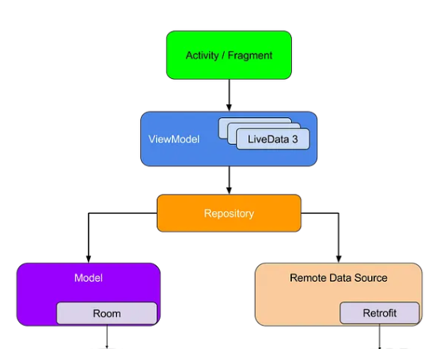

# **Gallery App** 

### **Gallery App** can access your photos from anywhere with security.!

This project is developed by **Abhay Saini** for Learning Purpose.

# Blog ✍

To know more about how I build this project, read my article on **Update soon**

## Application Install

***You can Install  app from below 👇***

## Setup
- Clone the repository on your machine.
- set it up by following its README.

## About

- Fully functional. 
- Clean and Simple Material UI.

## App Features

- **Image Gallery** - Browse through your entire photo collection with ease
- **Paging 3 Integration** - Seamlessly navigate through your extensive image library with the power of Paging 3 library, ensuring smooth performance even with large datasets.
- **MVVM Architecture** - Built using the Model-View-ViewModel architecture pattern, promoting separation of concerns and maintainability of code.
- **Zoom In and Zoom Out** - Get a closer look at your photos with zoom in and zoom out functionality, allowing you to appreciate every detail.
- **File Management** - You can create multiple folders to organize your storage just as you want it.

## Insights into the app 🔎

## 📸 Screenshots 

|   |   |   |
|---|---|---|
||  | 
||  | 

### Technical details 

- This app is made using Kotlin and following Modern Android Development practices.
- This app uses Kotlin Coroutines and Flow to handle all asynchronous tasks.
- This app uses some Jetpack libraries, Kotlin + XML and follows MVVM architecture . It also has a G.O.A.T rating in Android's  M.A.D scorecard.
- This app code follows all the best practices and software development principles which make it a very good learning resource for beginners as well as for people looking to improve thier software design skills.

## Built With 🛠
- [Kotlin](https://kotlinlang.org/) - First class and official programming language for Android development.
- [Coroutines](https://kotlinlang.org/docs/reference/coroutines-overview.html) - For asynchronous and more..
- [Flow](https://kotlin.github.io/kotlinx.coroutines/kotlinx-coroutines-core/kotlinx.coroutines.flow/-flow/) - A cold asynchronous data stream that sequentially emits values and completes normally or with an exception.
 - [StateFlow](https://developer.android.com/kotlin/flow/stateflow-and-sharedflow) - StateFlow is a state-holder observable flow that emits the current and new state updates to its collectors.
 - [SharedFlow](https://developer.android.com/kotlin/flow/stateflow-and-sharedflow) - A SharedFlow is a highly-configurable generalization of StateFlow.
- [Android Architecture Components](https://developer.android.com/topic/libraries/architecture) - Collection of libraries that help you design robust, testable, and maintainable apps.
  - [ViewModel](https://developer.android.com/topic/libraries/architecture/viewmodel) - Stores UI-related data that isn't destroyed on UI changes. 
  - [ViewBinding](https://developer.android.com/topic/libraries/view-binding) - Generates a binding class for each XML layout file present in that module and allows you to more easily write code that interacts with views.
- [Retrofit](https://square.github.io/retrofit/) - A type-safe HTTP client for Android and Java.
- [Coil](https://github.com/coil-kt/coil) - An image loading library for Android backed by Kotlin Coroutines.
- [Material Components for Android](https://github.com/material-components/material-components-android) - Modular and customizable Material Design UI components for Android.

## Package Structure

    
    com.example.galleryapp     # Root Package
    .
    ├── data                   # For data handling.
    |   ├── model              # Model data classes 
    │   ├── repo               # Single source of data.
    │   └── paging             # Pagination logic and data sources.
    |
    ├── ui                     # UI/View layer
    |   ├── adapters           # Adapter, ViewHolder 
    |   └── screens            # All App Screens 

## Architecture
This app uses [***MVVM (Model View View-Model)***](https://developer.android.com/jetpack/docs/guide#recommended-app-arch) architecture.

  

 ## Contact
If you need any help, you can connect with me.

Visit:- [Abhay Saini](https://www.linkedin.com/in/abhay-saini-%F0%9F%9A%80-09bb71200/)
  

